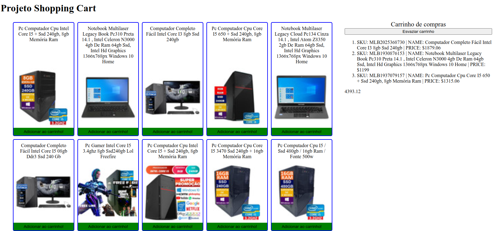

# Shopping Cart Project

Projeto da Trybe que consistia em criar um Front-End de uma loja virtual usando a API do Mercado Livre.

## Tecnologias Usadas:
- Vanilla JavaScript, HTML e CSS.

### Preview

